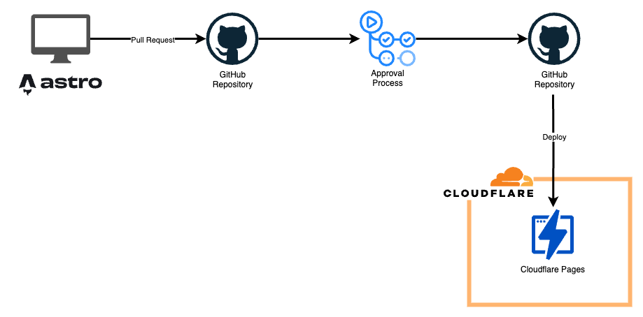

# 🐱 NecoFuryAI Personal Website

[](https://astro.build)
[](https://www.typescriptlang.org/)
[](https://tailwindcss.com)
[](https://daisyui.com)
[](https://pages.cloudflare.com)



> A modern, type-safe personal portfolio website built with Astro 5 and cutting-edge web technologies. Features blazing-fast performance, responsive design, and developer-friendly architecture.

## 🙏 Template Credits

This project is built upon the excellent [**Astrofy**](https://github.com/manuelernestog/astrofy) template by [Manuel Ernesto Garcia](https://github.com/manuelernestog). Astrofy is a free and open-source template for personal portfolio websites built with Astro and TailwindCSS, providing features like Blog, CV, Project Section, Store, and RSS Feed.

**Original Template**: [github.com/manuelernestog/astrofy](https://github.com/manuelernestog/astrofy)  
**License**: MIT License  
**Author**: Manuel Ernesto Garcia

## 🚀 Quick Start

### Prerequisites

- **Node.js** 18+ and **pnpm** (recommended) or npm
- Basic familiarity with Astro and TypeScript

### Installation

```bash
# Clone the repository
git clone https://github.com/necofuryai/necofuryai-personal-website.git
cd necofuryai-personal-website

# Install dependencies
pnpm install

# Start development server
pnpm dev
```

Open [http://localhost:4321](http://localhost:4321) in your browser to view the site.

## 🛠 Development Commands

| Command | Description |
|---------|-------------|
| `pnpm dev` | Start development server on port 4321 |
| `pnpm build` | Build for production with optimizations |
| `pnpm preview` | Preview production build locally |
| `pnpm astro` | Run Astro CLI commands |

## 🏗 Technical Architecture

### Core Technologies
- **🚀 Astro 5**: Modern meta-framework with islands architecture
- **📘 TypeScript**: Full type safety with strict null checks
- **🎨 Tailwind CSS**: Utility-first CSS framework
- **🧩 DaisyUI**: Component library for consistent UI patterns
- **📝 MDX Support**: Rich content with embedded React components
- **⚡ Cloudflare Pages**: Edge-optimized global deployment

### Performance Features
- **Zero-JS by default**: Astro's islands architecture for optimal performance
- **Automatic optimization**: Image compression with Sharp
- **RSS & Sitemap**: SEO-friendly content distribution
- **Progressive enhancement**: JavaScript only where needed

### Content Management
- **Content Collections**: Type-safe content with Zod validation
- **Dynamic routing**: File-based routing with TypeScript support
- **Theme system**: Dark/light mode with DaisyUI theming

## 📁 Project Structure

```
necofuryai-personal-website/
├── public/                    # Static assets & favicons
├── src/
│   ├── components/           # Reusable UI components
│   │   ├── cv/              # CV-specific components
│   │   └── *.astro          # Core components (Header, Footer, etc.)
│   ├── content/             # Content collections with schemas
│   ├── layouts/             # Page layout templates
│   │   ├── BaseLayout.astro # Main layout with drawer navigation
│   │   ├── PostLayout.astro # Blog post layout
│   │   └── StoreItemLayout.astro # E-commerce item layout
│   ├── pages/               # File-based routing
│   ├── styles/              # Tailwind & DaisyUI CSS entry
│   └── lib/                 # Utility functions & helpers
├── memory-bank/              # Project documentation & context
├── astro.config.mjs         # Astro configuration
├── renovate.json            # Renovate dependency management config
└── tsconfig.json            # TypeScript configuration
```

## 🎯 Key Features

### 🖥 Pages
- **Portfolio Homepage**: Showcasing skills and recent projects
- **Interactive CV**: Professional resume with timeline component
- **Project Gallery**: Technical project showcases with details
- **Hobbies**: Personal interests with embedded media
- **Personal PR**: Professional brand presentation

### 🧩 Components
- **Responsive Navigation**: Drawer-based mobile navigation
- **Theme Selector**: System/light/dark theme switching
- **Card Layouts**: Consistent content presentation
- **Timeline Component**: Professional experience visualization

### 🎨 Design System
- **DaisyUI Components**: Consistent, accessible UI components
- **Responsive Design**: Mobile-first approach with Tailwind
- **Theme Support**: Multiple color themes with CSS custom properties
- **Typography**: Readable fonts with proper scaling

## 🔧 Development Workflow

### Type Safety
- Strict TypeScript configuration with null checks
- Path aliases for clean imports (`@components/*`, `@layouts/*`)
- Zod schemas for content validation

### Code Quality
- TypeScript strict mode for better code quality
- Claude Code AI-assisted development (`.claude/` configuration)

### Dependency Management
- **Renovate**: Automated dependency updates with native pnpm support
- Ecosystem grouping (Astro, Tailwind) for coordinated updates
- Auto-merge for patch/minor updates; manual review for major versions

## 🌐 Deployment

Optimized for **Cloudflare Pages** with:
- Automatic builds from Git
- Global CDN distribution
- Edge-side rendering capabilities
- Perfect Lighthouse scores

### Build Process
```bash
pnpm build    # Generates static site in ./dist/
```

### Development Standards
- Follow existing TypeScript and component patterns
- Use DaisyUI classes for styling consistency
- Maintain responsive design principles
- Add proper TypeScript types for new features

## 📄 License

This project is licensed under the MIT License - see the [LICENSE](LICENSE) file for details.

This project is based on the [Astrofy](https://github.com/manuelernestog/astrofy) template, which is also licensed under the MIT License. All credits to the original template go to [Manuel Ernesto Garcia](https://github.com/manuelernestog).

---

**Built with ❤️ by [necofuryai](https://github.com/necofuryai)** - A software engineer based in Tokyo, Japan 🗾
